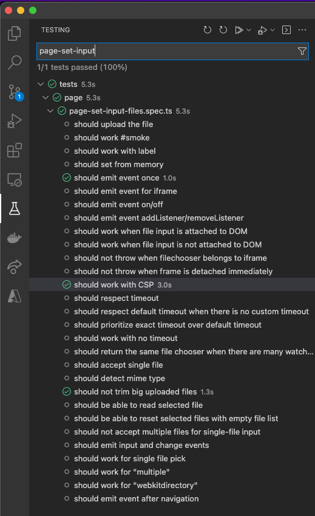

# [Playwright Test] for Visual Studio Code

This extension integrates [Playwright Test] with Visual Studio Code by using the [VSCode Testing API](https://code.visualstudio.com/api/extension-guides/testing).

## Requirements

- [Playwright Test] version 1.14+

## Usage

The extension automatically detects if you have [Playwright Test] installed and loads the [Playwright Test] projects into Visual Studio Code. By default it will select the first project and by right clicking on the play icon next to a test you can run a test in a specific browser (project).

All tests of the project are shown inside the Test Explorer on the left side.

When running a test via the play icon, it will run on the selected profiles. You can change them via the `Select Default Profile` dropdown.

[Playwright Test]: https://playwright.dev/docs/intro/#first-test
